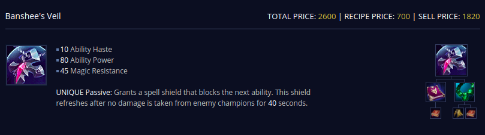
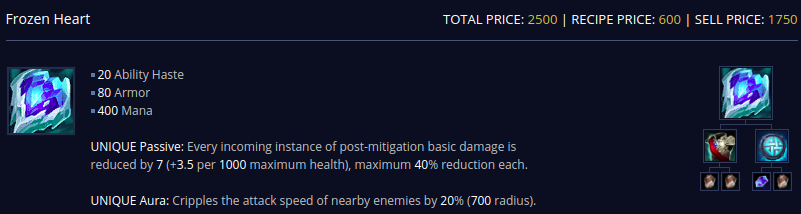
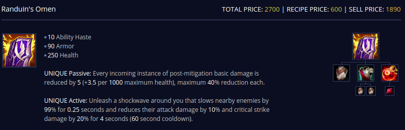
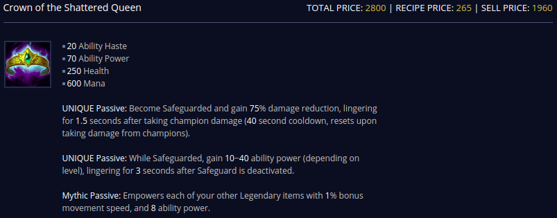
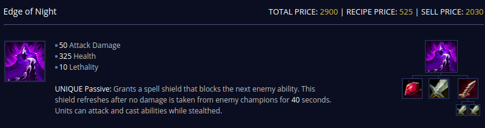
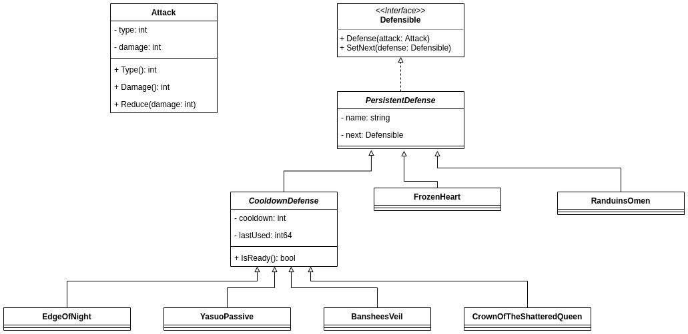
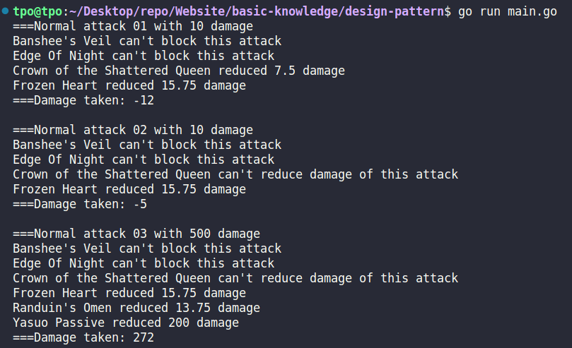
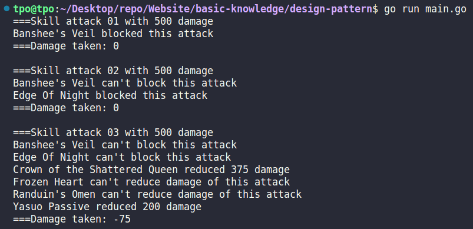

# Usage

Pass a request along a chain of handlers. The handler decides either to process the request, or to pass it to the next one in the chain.

# Implementation

## Idea

In order to deal damage, skill must break all champion's defences.

E.g:

## Class Diagram

## Output

### Defense normal attack

### Defense skill attack

# Reference

-   [https://leagueoflegends.fandom.com/wiki/Banshee%27s_Veil](https://leagueoflegends.fandom.com/wiki/Banshee%27s_Veil)
-   [https://leagueoflegends.fandom.com/wiki/Randuin%27s_Omen](https://leagueoflegends.fandom.com/wiki/Randuin%27s_Omen)
-   [https://leagueoflegends.fandom.com/wiki/Edge_of_Night](https://leagueoflegends.fandom.com/wiki/Edge_of_Night)
-   [https://leagueoflegends.fandom.com/wiki/Frozen_Heart](https://leagueoflegends.fandom.com/wiki/Frozen_Heart)
-   [https://leagueoflegends.fandom.com/wiki/Crown_of_the_Shattered_Queen](https://leagueoflegends.fandom.com/wiki/Crown_of_the_Shattered_Queen)
-   [https://www.mobafire.com/league-of-legends/champion/yasuo-117](https://www.mobafire.com/league-of-legends/champion/yasuo-117)
-   [https://refactoring.guru/design-patterns/chain-of-responsibility](https://refactoring.guru/design-patterns/chain-of-responsibility)
