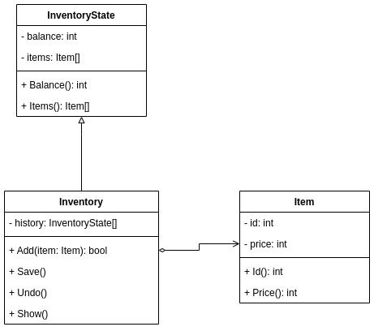
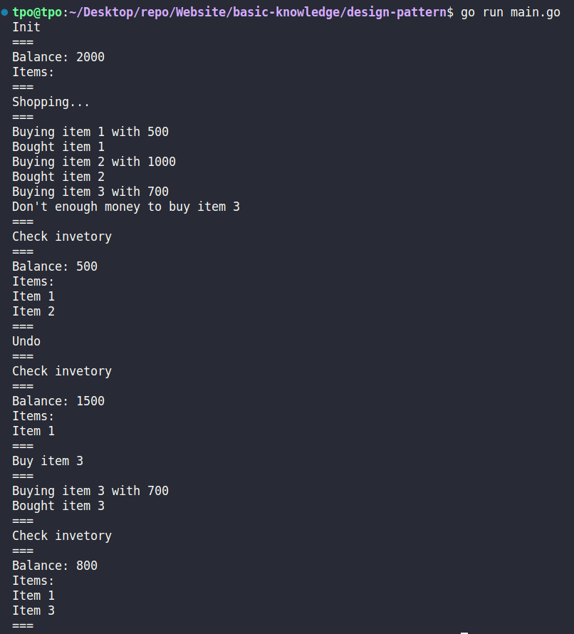

# Usage

Save and restore to previous state without revealing its details.

# Implementation

## Idea

Buy something and then undo to buy other ones.

## Class Diagram

## Output

# Reference

-   [https://refactoring.guru/design-patterns/memento](https://refactoring.guru/design-patterns/memento)
