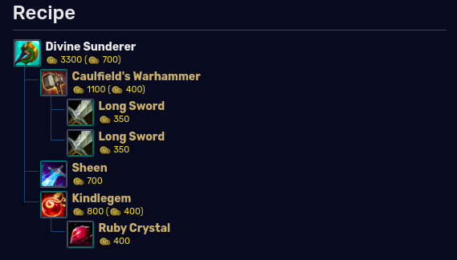
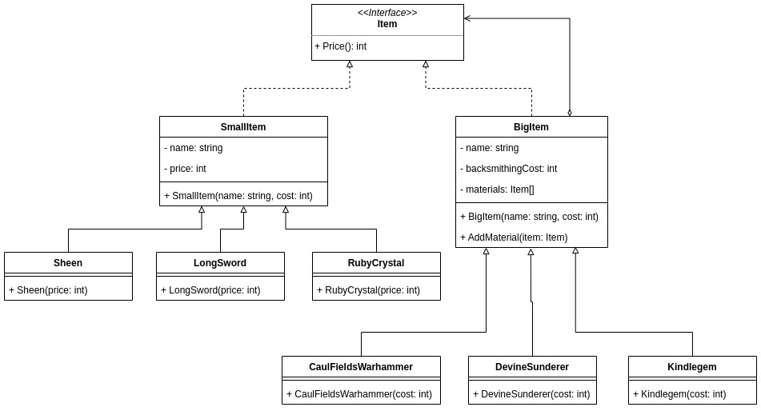
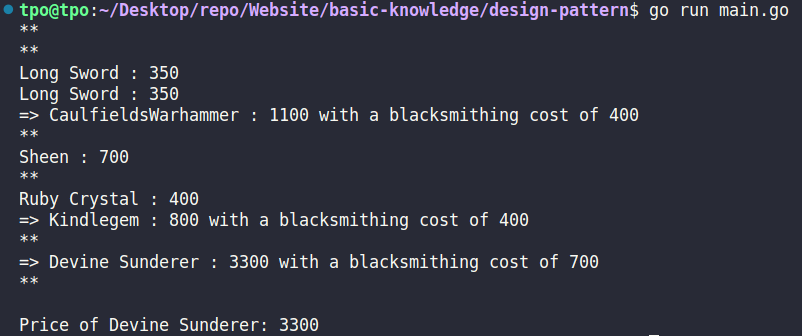

# Usage

Compose objects as tree structure and then work with them as if they are individual objects.

# Implementation

## Idea

Get price of a mythic item in LOL.

## Class Diagram

## Output

# Reference

-   [https://leagueoflegends.fandom.com/wiki/Divine_Sunderer](https://leagueoflegends.fandom.com/wiki/Divine_Sunderer)
-   [https://refactoring.guru/design-patterns/composite](https://refactoring.guru/design-patterns/composite)
